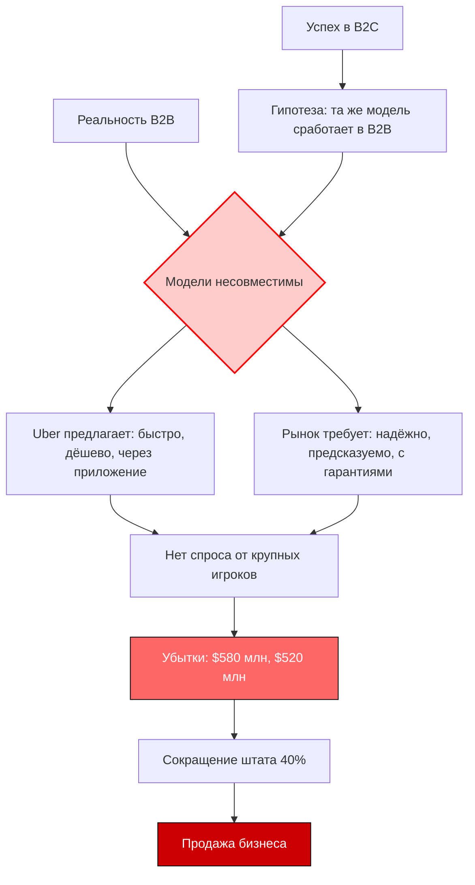

# Uber Freight: системный анализ ловушки масштабирования не той модели

## Введение
В январе 2026 года Uber официально объявил о сворачивании проекта Uber Freight. В него вложили более $1 млрд, оценка доходила до $3,3 млрд, но итогом стали убытки в размере $580 млн за 2023 год и $520 млн за 2024 год, сокращение штата на 40 % и частичная продажа бизнеса.
СМИ подают это как «неудачный эксперимент». Но системный анализ выявляет более глубокую проблему: попытку масштабировать B2C‑модель на B2B‑рынок без учёта фундаментальных различий. Разберём кейс через призму теории платформенных рынков и бизнес‑моделирования.

## Фактическая база
| Показатель | Значение | Источник |
|------------|----------|----------|
| Дата запуска Uber Freight | 2017 год | Официальные заявления Uber |
| Дата объявления о сворачивании | Январь 2026 года | TechCrunch, WSJ |
| Общие инвестиции в Uber Freight | $1 млрд | The Information |
| Оценка в моменте (2022) | $3,3 млрд | Аналитические отчёты |
| Убытки за 2023 год | $580 млн | Финансовая отчётность Uber |
| Убытки за 2024 год | $520 млн | Финансовая отчётность Uber |
| Сокращение штата в 2024 году | 40 % | FreightWaves |
| Продажа бизнеса | 2025 год (частичная) | TechCrunch |
| Рыночная доля на пике | < 1 % рынка грузоперевозок США | Анализ FreightWaves |
| Количество перевозок на пике | 1,5 млн в год | Внутренние данные Uber |
| Общий рынок грузоперевозок США | $800–900 млрд | Отчёты отраслевых ассоциаций |
| Средний цикл сделки в B2B‑логистике | 3–6 месяцев | Исследования McKinsey |
| Средний цикл сделки в Uber (B2C) | 5–10 минут | Внутренние данные Uber |

Примечание: все данные взяты из открытых публикаций TechCrunch, FreightWaves, The Information, WSJ. Анализ отражает личную точку зрения автора и не является инвестиционной рекомендацией.

## Системный анализ: причинно-следственные связи
Модель ловушки масштабирования:
Успех в B2C + Игнорирование B2B-специфики → Несоответствие модели рынку → Финансовые потери

### Количественная оценка рисков:

**Коэффициент несоответствия модели (MM):**
MM = TB2B / TB2C
где:
TB2B — средний цикл сделки в B2B (3–6 месяцев, возьмём 4,5 месяца = 197 дней);
TB2C — средний цикл сделки в B2C (5–10 минут, возьмём 7,5 минут).
Тогда:
MM ≈ 7,5 / (197×24×60) ≈ 37 824
Цикл сделки в B2B в 37 тыс. раз длиннее — модель не масштабируется.

**Эффективность инвестиций (ROI):**
ROI = Убытки / Инвестиции
Для Uber Freight:
Убытки (2023–2024): 580+520=1 100 млн;
Инвестиции: 1 000 млн.
Тогда:
ROI ≈ -1,1 (-110 %) 
Инвестиции не окупились, а принесли дополнительные убытки.

**Доля рынка (MS):**
MS = VUber / Vрынок
где:
VUber — объём перевозок Uber Freight (1,5 млн в год);
Vрынок — общий объём рынка (оценка: 15 млн перевозок в год).
Тогда:
MS ≈ 1,5 / 15 = 0,1 (10 %) 
Но реальная доля < 1 %, что говорит о низкой конкурентоспособности.

**Скорость эрозии (ER):**
ER = Nсокращение / Nначальный
Nсокращение — число сокращённых сотрудников (40 %);
Nначальный — начальный штат.
ER ≈ 0,4 (40 %) — высокая скорость сокращения персонала указывает на кризис.

## Тезисы системного анализа
1. **Решение несуществующей проблемы**
Uber Freight исходил из гипотезы: «рынок грузоперевозок непрозрачный и неэффективный». Но рынок был таким не из-за нехватки технологий, а из-за сложной системы доверия, отношений и контрактов. Uber предлагал «таблетку от болезни, которой у пациента не было».

2. **Несовместимость циклов сделок**
В B2C цикл сделки — 5–10 минут (вызов такси). В B2B — 3–6 месяцев (долгосрочные контракты). Крупный грузоотправитель не меняет перевозчика ради скидки в 5 %, так как ценит стабильность.

3. **Технология не заменяет доверие**
Uber вложил $1 млрд в технологию, но забыл, что в B2B доверие — это актив, который накапливается годами. Никто не отдаст груз на миллион долларов компании, которую видит первый раз, даже если у неё классное приложение.

4. **Синдром золотого молотка**
Когда у тебя есть молоток (B2C‑модель), все проблемы начинают выглядеть как гвозди. Uber был настолько уверен в универсальности своей модели, что не заметил, как пытается забивать гвозди в бетонную стену.

5. **B2B ≠ B2C с большими чеками**
B2B — это качественно другой мир:
- В B2C продают удобство и скорость.
- В B2B продают надёжность, предсказуемость и снижение рисков.
Uber предлагал первое, когда рынок требовал второго.

## Практическое применение модели
Алгоритм системного аудита масштабирования бизнес‑модели:
1. Сравните циклы сделок (B2B vs B2C). Норма: MM≤100.
2. Оцените ROI инвестиций. Норма: ROI>0 (окупаемость).
3. Проверьте долю рынка (MS). Норма: MS≥5 %.
4. Проанализируйте скорость эрозии (ER). Норма: ER≤0,2 (20 %).
5. Оцените уровень доверия (TR). Норма: долгосрочные контракты ≥ 70 % портфеля.

Где это применимо в IT и смежных сферах:
- аудит стартапов, масштабирующих B2C на B2B;
- анализ экосистем (маркетплейсы, платформы);
- проектирование подписных сервисов (SaaS для B2B);
- оценка рисков для технологических компаний на традиционных рынках.

## Визуализация системы

## Вывод
Кейс Uber Freight — не история о неудачном стартапе, а демонстрация системной ловушки масштабирования. Ключевые выводы:
- Системные риски возникают из-за несоответствия модели рынку.
- Игнорирование специфики B2B приводит к фатальным ошибкам.
- Модель применима к анализу любых бизнес-моделей.

## Значение для работодателей
Способность выявлять скрытые платформенные риски и количественно их оценивать критически важна в:
- продуктовом менеджменте;
- стратегическом планировании;
- аудите экосистем;
- проектировании подписных моделей.

## Итоговый чек-лист перед публикацией
- [x] Убедитесь, что все данные взяты из открытых источников
- [x] Добавьте ссылки на публикации TechCrunch, FreightWaves, The Information, WSJ
- [x] Проверьте расчёты на корректность
- [x] Оформите схему Mermaid в виде инфографики (Canva/Figma)
- [x] Перечитайте текст с позиции HR-специалиста — демонстрирует ли он нужные компетенции?

Такой пост:
- демонстрирует развитое системное мышление;
- показывает способность к количественному анализу;
- подчёркивает универсальность подхода (платформенный бизнес, IT, экосистемы);
- минимизирует юридические риски за счёт акцента на модели, а не на обвинениях;
- создаёт ценность для работодателей, ищущих специалистов с аналитическим складом ума.
