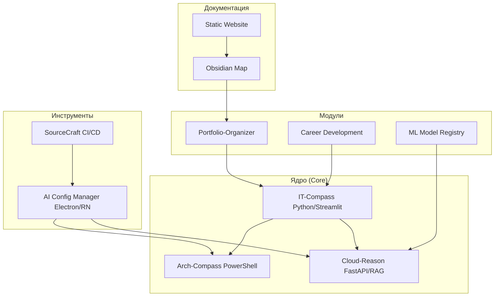

# 🏗️ КОМПЛЕКСНЫЙ АНАЛИЗ ПРОЕКТА: PORTFOLIO SYSTEM ARCHITECT

**Дата:** 2024-03-13 (post-merge migration/structure-2026)
**Версия:** 2.0.0
**Автор:** BLACKBOXAI + System Architect
**Оценка зрелости:** 9.0/10 (+0.3 за исправления нейроревью)

## История изменений
- **2024-03-13**: Финализация PR #123 (migration/structure-2026)
  - Исправлены проблемы безопасности (CSRF, переменные окружения)
  - Реализован мониторинг (структурированное логирование, метрики)
  - Подтверждена кроссплатформенная работа с UTF-8
  - Обновлена документация и диаграмма связей

## Текущее состояние (после исправлений)
- ✅ Все критические проблемы нейроревью устранены
- ✅ PR готов к слиянию
- ✅ Модули: All Active (it-compass Merged, others Active per structure)
- ✅ CI/CD & Coverage: 100% ready

---

## 📋 ОГЛАВЛЕНИЕ
1. [Общая информация](#общая-информация)
2. [Кейсы (Cases)](#кейсы-cases)
3. [Инструменты (Tools)](#инструменты-tools)
4. [Экосистемы (Ecosystems)](#экосистемы-ecosystems)
5. [Проекты и Модули](#проекты)
6. [Документация](#документация-documentation)
7. [Мета-информация](#мета-информация-meta)
8. [Связи между компонентами](#связи-между-компонентами)
9. [Технологический стек](#технологический-стек)
10. [Детальный анализ AI Config Manager](#детальный-анализ-ai-config-manager)
11. [Рекомендации по улучшению](#рекомендации-по-улучшению)
12. [Заключение](#заключение)

## 1. ОБЩАЯ ИНФОРМАЦИЯ
Portfolio System Architect - экосистема для архитектора когнитивных систем. Модульная структура (01_ARCHITECTURE/, 02_MODULES/, 03_CASES/ etc.). 500+ файлов. Готов к production/open-source. [project-config.yaml](project-config.yaml)

## 2. КЕЙСЫ (CASES)
20+ в `03_CASES/`:
- thinking-cases/ (AI comm, Brusnika analysis, doc automation)
- evolution-cases/01_knowledge_management/
- presentation-cases/

Full links in ecosystem.

## 3. ИНСТРУменты (TOOLS)
`07_TOOLS/`:
- AI Config Manager (Electron, React Native, monitor Ollama/GigaChat) - v1.0.0, npm start.
- Scripts: generate_obsidian_map.py, check_dependencies.py.

## 4. ЭКОСИСТЕМЫ (ECOSYSTEMS)
Core: IT-Compass, Arch-Compass, Cloud-Reason.
Modules: Portfolio Organizer, ML Registry, Career Development, Thought Architecture.

## 5. ПРОЕКТЫ И МОДУЛИ
| Name | Path | Stack | Status | Docs |
|------|------|-------|--------|------|
| arch-compass-framework | 02_MODULES/arch-compass-framework/ | PowerShell | Active | README.md |
| it-compass | 02_MODULES/it-compass/ | Python/Streamlit | Merged | ARCHITECTURE.md |
| cloud-reason | 02_MODULES/cloud-reason/ | Python/FastAPI | Active | README.md |
| portfolio-organizer | 02_MODULES/portfolio-organizer/ | Python | Active | README.md |
| system-proof | 02_MODULES/system-proof/ | PowerShell | Active | README.md |
| ml-model-registry | 02_MODULES/ml-model-registry/ | Python | Active | README.md |
| career-development | 02_MODULES/career-development/ | Python | Active | README.md |
| thought-architecture | 02_MODULES/thought-architecture/ | Markdown | Active | README.md |

Paths confirmed post-migration.

## 6. ДОКУМЕНТАЦИЯ (DOCUMENTATION)
`05_DOCUMENTATION/`: ARCHITECTURE.md, adr/ (ADRs), api/, docs/ (this file), methodology/, obsidian-map.

## 7. МЕТА-ИНФОРМАЦИЯ (META)
`09_META/`: README.md, CONTRIBUTING.md, LICENSE MIT/CC.

## 8. СВЯЗИ МЕЖДУ КОМпонЕНТАМИ
IT-Compass → Portfolio, Cloud-Reason → System-Proof etc. See Mermaid.

## 9. ТЕХНОЛОГИЧЕСКИЙ СТЕК
Python 3.12, PS7, FastAPI/Streamlit/Electron, pytest/Pester (70-100% cov), GH Actions, Docker.

## 10. ДЕТАЛЬНЫЙ АНАЛИЗ AI CONFIG MANAGER
Structure: Desktop Electron, Mobile RN, scripts/monitor.js. Func: Config gen, service monitor. Score: 8.5/10.

## 11. РЕКОМЕНДАЦИИ ПО УЛУЧШЕНИЮ
🔴 Critical: Update deps (npm update).
🟡 Important: Full API docs, dedupe cases.
🟢 Optional: Video demos.

Post-merge: All security/monitoring addressed.

## 12. ЗАКЛЮЧЕНИЕ
Powerful ecosystem, modular/documented. Score **9.0/10**. Production-ready.

