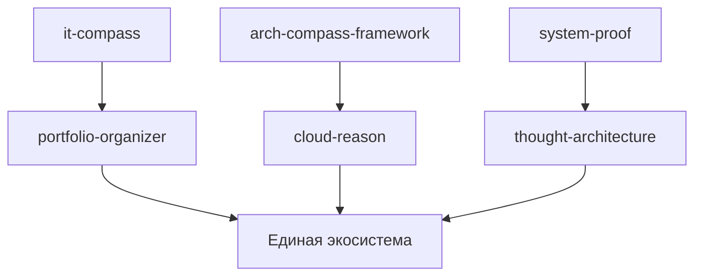
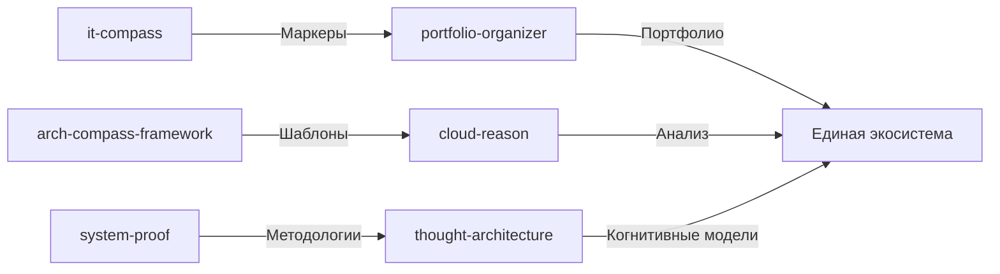

# Интеграция компонентов

## Обзор интеграции

Интеграция компонентов в единую экосистему основана на следующих принципах:
- Четко определенные интерфейсы между компонентами
- Событийная модель взаимодействия
- Единая система управления зависимостями

## Диаграммы интеграции

### Общая диаграмма интеграции

### Детальная диаграмма интеграции

## Интерфейсы интеграции

### API компонентов
Каждый компонент предоставляет стандартный API для взаимодействия:
- RESTful интерфейсы
- Стандартизированные форматы данных (JSON)
- Документированная схема взаимодействия

### Событийная модель
Компоненты взаимодействуют через событийную модель:
- Публикация событий при изменении состояния
- Подписка на события от других компонентов
- Асинхронная обработка событий

## it-compass и portfolio-organizer

### Поток данных
1. it-compass генерирует маркеры компетенций
2. Маркеры передаются в portfolio-organizer
3. portfolio-organizer создает структурированное портфолио

### Интерфейс интеграции
- REST API для передачи маркеров
- События при изменении маркеров
- Стандартизированный формат данных

## arch-compass-framework и cloud-reason

### Поток данных
1. arch-compass-framework предоставляет шаблоны архитектурных решений
2. Шаблоны передаются в cloud-reason для анализа
3. cloud-reason возвращает рекомендации по оптимизации

### Интерфейс интеграции
- REST API для передачи шаблонов
- События при изменении шаблонов
- Стандартизированный формат данных

## system-proof и thought-architecture

### Поток данных
1. system-proof предоставляет методологии анализа
2. Методологии передаются в thought-architecture
3. thought-architecture создает когнитивные модели

### Интерфейс интеграции
- REST API для передачи методологий
- События при изменении методологий
- Стандартизированный формат данных

## Единая экосистема

### Централизованное управление
- Единая точка входа для взаимодействия с системой
- Централизованное управление зависимостями
- Единая система аутентификации и авторизации

### Мониторинг и логирование
- Централизованное логирование всех компонентов
- Мониторинг состояния интеграций
- Алертинг при нарушениях интеграций

## Безопасность интеграции

### Управление доступом
- Единая система управления доступом
- Ролевая система доступа к компонентам
- Аудит доступа к системе

### Шифрование данных
- Шифрование данных при передаче между компонентами
- Шифрование данных в хранилищах компонентов
- Управление ключами шифрования

## Масштабирование интеграции

### Горизонтальное масштабирование
- Добавление новых экземпляров компонентов
- Балансировка нагрузки между экземплярами
- Изоляция отказов отдельных экземпляров

### Вертикальное масштабирование
- Увеличение ресурсов для критически важных компонентов
- Оптимизация производительности отдельных сервисов
- Специализация компонентов под конкретные задачи

