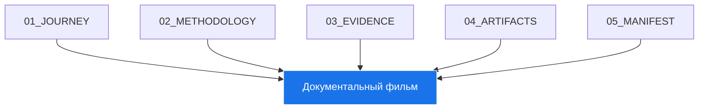

# 🏗️ Архитектура Portfolio System Architect

> **Документальный фильм о рождении новой профессии: Архитектор когнитивных систем**

---

## 🎯 Цель

Создать **единый, целостный, живой репозиторий `portfolio-system-architect`**, который:
- Станет **доказательством концепции новой роли в IT**
- Покажет, как **системное мышление преображается в архитектурную компетенцию**
- Будет основой для **подачи на грант Sourcecraft Open Source**
- Ответит на главный вопрос:
  > «Кто ты?» →
  > «Я — архитектор когнитивных систем. Я проектирую системы, в которых человек управляет ИИ для создания новых форм экспертизы.»

---

## 🧩 Архитектура системы

Этот репозиторий — не просто код, а **структурированное повествование о моем пути** от нуля к новой профессии. Он состоит из пяти основных глав:

### 1. 01_JOURNEY: Путь (Доказательство эволюции)
- **Назначение**: Повествование о моем пути.
- **Функции**:
  - Документирование эволюции от Excel-таблицы к методологии IT-Compass.
  - Демонстрация преодоления периода хаоса через RAG и Reasoning.
  - Показ эволюции от отдельных инструментов к единой, взаимосвязанной экосистеме.

### 2. 02_METHODOLOGY: Ядро (То, что создано)
- **Назначение**: Представление моих авторских методов.
- **Функции**:
  - Описание методологии объективных маркеров компетенций (IT-Compass).
  - Реализация архитектурного фреймворка (Arch-Compass).
  - Систематизация маркеров компетенций по областям.

### 3. 03_EVIDENCE: Доказательства (Что работает)
- **Назначение**: Демонстрация работающих систем.
- **Функции**:
  - Автоматизированная индексация и обработка тысяч файлов через RAG-систему.
  - Реализация циклов ИИ-анализа для извлечения инсайтов.
  - Автоматическая генерация портфолио из собранных доказательств.

### 4. 04_ARTIFACTS: Артефакты (Результаты)
- **Назначение**: Конкретные кейсы и демонстрации.
- **Функции**:
  - Сбор и систематизация кейсов применения из диалогов.
  - Создание интерактивных демонстраций (HTML, скрипты).
  - Подготовка материалов для гранта.

### 5. 05_MANIFEST: Манифест (Кто я теперь)
- **Назначение**: Финальное заявление.
- **Функции**:
  - Формулирование новой профессиональной роли «Архитектор когнитивных систем».
  - Документирование архитектуры всей экосистемы.
  - Полное описание авторской методологии.

---

## 🔄 Интеграция

### 1. Единая точка входа
- Все компоненты интегрированы через `cognitive-architect-manifesto/`
- Единая документация и методология

### 2. Автоматизация
- Ежедневная генерация карты знаний и сайта
- Автообновление через GitHub Actions

### 3. Живая система
- Постоянное обновление и развитие
- Открытость для вкладов

---

## 🛠️ Техническая реализация

### 1. Языки и фреймворки
- **Python**: основной язык программирования
- **Markdown**: документация
- **Mermaid**: диаграммы
- **HTML/CSS/JS**: веб-сайт
- **PowerShell**: скрипты автоматизации

### 2. Инструменты
- **Git**: система контроля версий
- **GitHub Actions**: CI/CD
- **Obsidian**: карта знаний
- **Bootstrap**: фронтенд

### 3. Автоматизация
- **generate_obsidian_map.py**: генератор карты знаний
- **generate_website.py**: генератор сайта
- **run_daily.ps1**: ежедневная автоматизация

---

## 📈 Эволюция

### 1. Итерации
- Постоянное улучшение компонентов
- Адаптация к новым требованиям

### 2. Обратная связь
- Вклад сообщества
- Анализ использования

### 3. Масштабирование
- Расширение функциональности
- Интеграция с новыми инструментами

---

## 🏆 Грант Sourcecraft Open Source

> «Этот репозиторий — мое доказательство концепции.
> За два года я прошла путь от Excel-таблички до архитектора когнитивных систем.
> Я не пишу код — я проектирую системы, в которых ИИ становится моим агентом.
> Моя работа — это вклад в будущее профессии, где ценность создается через системное мышление и оркестрацию технологий.»
