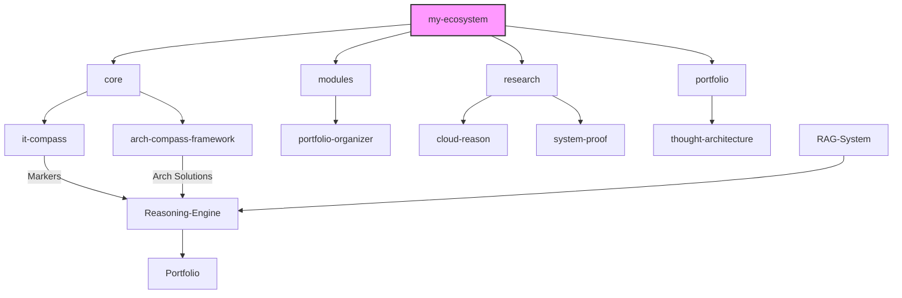

# 🗺️ Ecosystem Map from my-ecosystem-FINAL

Adapted from ECOSYSTEM_MAP.md + README.md.

## Mermaid Diagram

## Key Relations
- IT-Compass → Reasoning ← Arch-Compass
- Notes → RAG → Reasoning → IT-Compass Markers → Portfolio-Organizer

**Source**: C:/Users/Z/my-ecosystem-FINAL. **Integration**: Aligns with current apps/.
