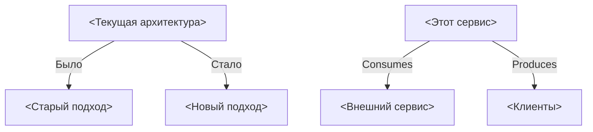
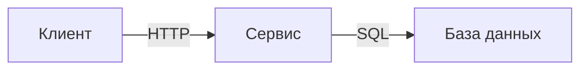
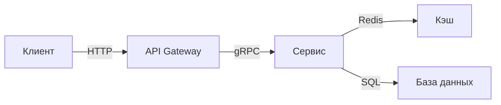

# ADR-XXX: <Краткое название решения>

**Статус:** 🟢 Принято | 🟡 В обсуждении | 🔴 Отклонено | ⚫ Устарело  
**Дата:** `<YYYY-MM-DD>`  
**👤 Ответственный:** `GitHub: @Control39`  
**Связанный сервис:** [`<service-name>`](../../apps/<service-name>/README.md)

---

## 🎯 Контекст

<Опишите проблему или ситуацию, которая потребовала архитектурного решения. Почему это важно?>

**Факты:**
- <Факт 1: например, "Сервис X потребляет 80% CPU при пиковой нагрузке">
- <Факт 2: например, "Текущая архитектура не поддерживает масштабирование">
- <Факт 3: например, "Команда выросла до N человек, нужны стандарты">

---

## 💡 Идея и гипотеза

**Гипотеза:**  
<Какая идея лежит в основе решения? Почему это должно сработать?>

**Ожидаемый результат:**  
<Что изменится после внедрения? Какие метрики улучшатся?>

**Альтернативы, которые рассматривались:**
1. <Альтернатива A> — <почему отвергнута>
2. <Альтернатива B> — <почему отвергнута>
3. <Альтернатива C> — <почему отвергнута>

---

## 💼 Бизнес-интерес

| Стейкхолдер | Выгода | Метрика успеха |
|-------------|--------|----------------|
| **Разработчики** | <Ускорение разработки, снижение когнитивной нагрузки> | <Например: -30% времени на онбординг> |
| **DevOps** | <Упрощение деплоя, мониторинга, масштабирования> | <Например: 99.9% uptime> |
| **Бизнес** | <Прямая ценность: рост конверсии, снижение затрат, новые возможности> | <Например: +15% скорость вывода фич> |
| **Команда** | <Обучение, стандартизация, снижение текучки> | <Например: 100% покрытие тестами> |

---

## 🗺️ Интеграции (Вход/Выход)

### Схема изменений (Mermaid)



### Что меняется (Consumes)

| Источник | Было | Стало | Влияние |
|----------|------|-------|---------|
| `<Сервис X>` | <Старый API> | <Новый API> | <Например: breaking change> |
| `<База данных>` | <Старая схема> | <Новая схема> | <Миграция данных> |

### Что меняется (Produces)

| Потребитель | Было | Стало | Влияние |
|-------------|------|-------|---------|
| `<Клиент Y>` | <Старый формат> | <Новый формат> | <Адаптер на стороне клиента> |
| `<Аналитика>` | <Редкие события> | <Real-time потоки> | <Улучшение метрик> |

---

## 🧪 Доказательство (Как применила я)

**Контекст применения:**  
<Опиши конкретный кейс, где ты применила это решение. Какой был результат?>

**Эксперименты:**
- 📊 **Тестовая нагрузка:** <Например: 1000 RPS, latency снизился с 200ms до 50ms>
- 📈 **Метрики:** <Например: CPU с 80% до 40%, память с 4GB до 2GB>
- 📸 **Артефакты:** <Ссылка на скриншот Grafana / лог / отчёт>

**Результат в портфолио:**  
<Ссылка на раздел портфолио, где это продемонстрировано>

---

## 🚀 Переиспользуемость (Как применить вы)

**Паттерн:**  
<Какой архитектурный паттерн здесь реализован?>

**Когда применять:**
- ✅ <Условие 1: например, "Нужна централизованная конфигурация">
- ✅ <Условие 2: например, "Требуется hot reload">
- ❌ <Когда НЕ применять: например, "Для простых CLI-утилит">

**Инструкция копирования:**
```bash
# 1. Скопировать структуру
cp -r apps/<this-service> apps/my-new-service

# 2. Переименовать
sed -i 's/<this-service>/my-new-service/g' apps/my-new-service/*

# 3. Настроить конфигурацию
# Редактировать config/<service>-config.yaml

# 4. Реализовать бизнес-логику

# 5. Написать тесты

# 6. Запустить
docker-compose up -d my-new-service
```

**Ограничения:**  
<При каких условиях это решение НЕ работает?>

---

## 🏗️ Техническая реализация

### До принятия

<Описание текущей/старой архитектуры>



### После внедрения

<Описание новой архитектуры>



### Ключевые изменения

| Компонент | Было | Стало | Причина |
|-----------|------|-------|---------|
| `<Сервис X>` | <Технология A> | <Технология B> | <Производительность> |
| `<База данных>` | <Старая схема> | <Новая схема> | <Масштабируемость> |

---

## 🗓️ План развития и ресурсы

### Дорожная карта

| Горизонт | Цель | Критерий успеха | Статус |
|----------|------|-----------------|--------|
| 🔥 2 недели | <Задача 1: например, "Миграция данных"> | <Метрика> | 🟡 В работе |
| 📅 1-2 мес | <Задача 2: например, "Оптимизация запросов"> | <Метрика> | ⚪ Планируется |
| 🚀 3-6 мес | <Задача 3: например, "Масштабирование на N инстансов"> | <Метрика> | ⚪ В бэклоге |

### Ресурсы

✅ **Уже есть:**
- <Вычисления: локальный GPU, облачные инстансы>
- <Данные: датасеты, логи, метрики>
- <Знания: документация, исследования>
- <Инфраструктура: Kubernetes, CI/CD>

🔄 **Нужно привлечь:**
- <Доступ к Yandex Cloud>
- <Экспертиза по безопасности>
- <Финансирование на масштабирование>

⚠️ **Риски / Блокеры:**
- <Единая точка отказа → план Б: fallback на локальный кэш>
- <Нехватка персонала → автоматизация>

### 🤝 Как можно помочь

**Запросы к сообществу:**
- 🛠️ **Техническая помощь:** <Например: ревью PR по безопасности>
- 🧠 **Экспертиза:** <Например: консультация по архитектуре>
- 🤝 **Помощь:** <Например: участие в разработке, тестирование>
- 📢 **Продвижение:** <Например: рассказывать на митапах>

**Контакты:** `GitHub: @Control39`

---

## 📊 Метрики

| Показатель | До | После | Изменение | Статус |
|------------|------|-------|-----------|--------|
| **Производительность** | <X RPS> | <Y RPS> | <+Z%> | ✅ |
| **Latency (P95)** | <X ms> | <Y ms> | <↓Z%> | ✅ |
| **CPU usage** | <X%> | <Y%> | <↓Z%> | ✅ |
| **Memory usage** | <X GB> | <Y GB> | <↓Z%> | ✅ |
| **Cost** | <X RUB/мес> | <Y RUB/мес> | <↓Z%> | ✅ |

---

## 🔗 Перекрестные ссылки

- **Реализация:** [`<service-name>`/README.md](../../apps/<service-name>/README.md)
- **Другие ADR:**
  - [ADR-YYY: <Название>](ADR-YYY-<related>.md)
  - [ADR-ZZZ: <Название>](ADR-ZZZ-<related>.md)
- **Документация:** [../ARCHITECTURE.md](../ARCHITECTURE.md)

---

## 📝 История изменений

| Версия | Дата | Автор | Изменение |
|--------|------|-------|-----------|
| 1.0 | YYYY-MM-DD | @username | Первоначальное решение |
| 1.1 | YYYY-MM-DD | @username | Обновление метрик |
| 2.0 | YYYY-MM-DD | @username | Breaking change |

---

**Принято:** `<да/нет>`  
**Дата утверждения:** `<YYYY-MM-DD>`  
**Ревизия:** `<YYYY-MM-DD>` (последняя проверка актуальности)

---

*© 2026 Portfolio System Architect Team*
