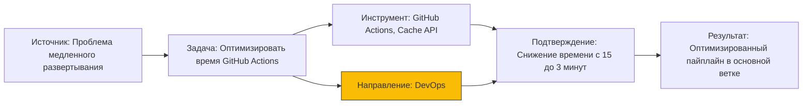
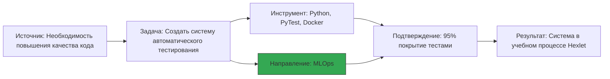
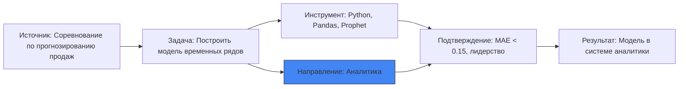
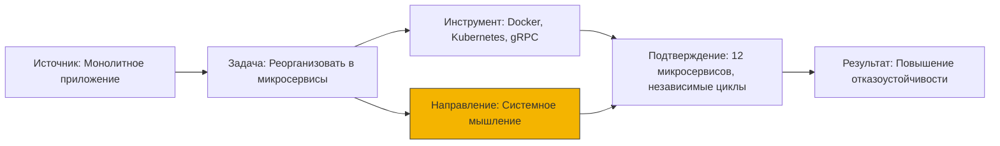
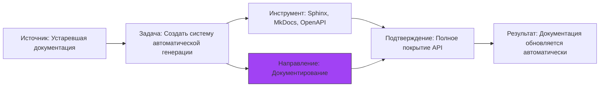
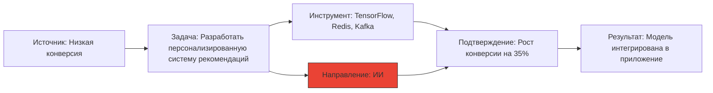

# Интерактивная визуализация reasoning-маршрутов

Добро пожаловать в интерактивную визуализацию reasoning-маршрутов! Здесь вы можете исследовать различные маршруты мышления, фильтровать их по направлениям и изучать структуру логических цепочек.

## Фильтрация по направлениям

<select id="direction-filter" onchange="filterRoutes()">
  <option value="all">Все направления</option>
  <option value="Аналитика">Аналитика</option>
  <option value="DevOps">DevOps</option>
  <option value="MLOps">MLOps</option>
  <option value="Документирование">Документирование</option>
  <option value="ИИ">ИИ</option>
  <option value="Системное мышление">Системное мышление</option>
</select>

## GitHub: Оптимизация CI/CD пайплайна

## Hexlet: Реализация системы автоматического тестирования

## Kaggle: Прогнозирование временных рядов

## Системная интеграция: Микросервисная архитектура

## Документирование: Автоматизация технической документации

## Искусственный интеллект: Система рекомендаций

