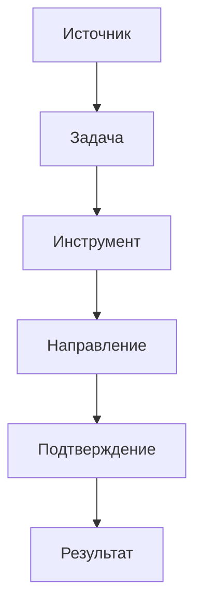
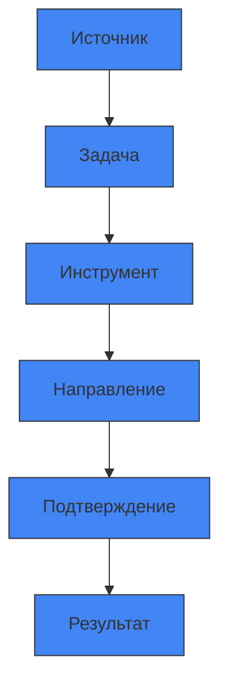
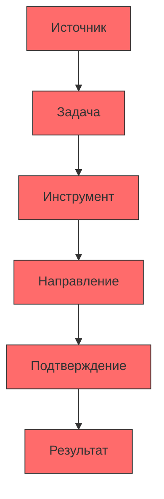

# Интерактивная визуализация reasoning-графа

Этот документ содержит интерактивную визуализацию reasoning-графа с использованием Mermaid.js.

## Reasoning-граф

## Фильтрация по направлениям

## Фильтрация по уровням сложности

